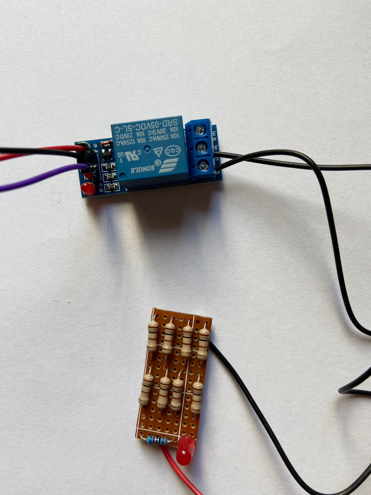
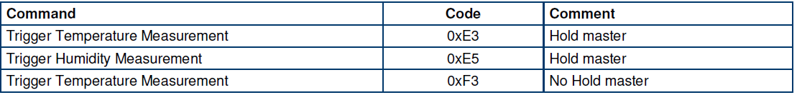
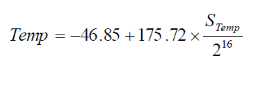

# Temperature-monitoring-system
This project aims to design a greenhouse temperature monitoring and control system by using a HTU21D temperature sensor that is connected to a Intel Galileo gen 2 board. 


## Hardware resources: 
* seven segment display
* 12 V supply
* resistors
* NPN transistors
* command relay
* breadboard
* jumpers
* Intel Galileo gen 2 board

## Software resources:
* Arduino.exe\\

## Why do you need this project?
The purpose of the system is to maintain a stable temperature in a greenhouse in a certain temperature interval. 
To simulate a temperature change, you should make a heating resistance connected to a command relay that will start to heat when it is connected to a supply. 



A LED is also added to the heating assembly which will be __off__ when the sensor detects a temperature higher than the desired one and __on__ when the temperature must reach that temperature. To display the monitored temperature, a seven-segment display is used. If you want find a detailed description of it, click [here](https://github.com/IoanaBraslasu/Temperature-monitoring-system-/blob/main/seven-segment%20display%20info.pdf).


## The Most Important Part: HTU21D temperature sensor
The HTU21D sensor is connected to a constant voltage of 3.3V from the analog input pins of the
microcontroller. In order for the I2C communication to be established properly, you connect the serial clock pin and serial data pins from the digital part of the board to the outputs of the sensor.

Using the functions from “Wire.h” library, the transmission starts using the sensor address: the
hexadecimal value 0X40 and the temperature value is extracted from the internal register address of the sensor.

```C++
  Wire.beginTransmission(SensorAddress);
  Wire.write(byte(0xE3));
  Wire.endTransmission();
```


This sensor works in 2 different modes: __Hold Masters__ and __No Hold Master__.The Hold Master mode is needed for this project and has the address 0xE3 as is the table below.  In the Hold Master mode, the HTU21D sensor pulls down the SCK line while measuring to force the master into a wait state. By releasing the SCK line, the HTU21D sensor indicates that internal processing is complete, and the transmission may be continued.




## Temperature Display
In the end, the 2 bytes are requested from the sensor that you need to read the temperature and if they are available, they can be displayed it on the 7-segment display.

These 2 bytes are next-up converted into the temperature in degrees Celsius using the formula from the datasheet and we store this value in the __temp__ variable:




Next, we will check if the temperature from the senosr is in the desired interval. If the heating resistance provides a tmperature higher than it is required, it will be powerd off with the command __digitalWrite__ on mode __HIGH__.

Finally, the temperature is written on the 7-segment display. The numeber is display almost simultaneously using the control resistances.


```C++
  if (temp>=30)    
  {
    digitalWrite(relay,HIGH);

  }

  for( int i = 0; i <150; i = i++)
  {
  disp(temp2,Rez1);   //display digit 1 (most left)
  delay(10);
  digitalWrite(Rez1, LOW);
  disp(temp1, Rez2);   // display digit 2 (second most left)
  delay(10);
  digitalWrite(Rez2, LOW);
  }
```


